# TABLE++

Цей застосунок створений для спрощення та пришвидшення ведення обліків в невеликих компаніях. 

Головні моделі: таблиці та їх колонки, користувачі, групи, дозволи та посади. Кожен користувач містить інформацію про відповідного робітника(його ім'я, посада, пошта, пароль, чи є він супер користувачем). 

Також реалізована система дозволів, за допомогою яких користувачу надається можливість або забороняється виконувати такі дії: читання, запис або видалення інформації про талбцию або колонки в цій таблиці. Є дозволи груп, які налаштовуються у відповідній групі, такі дозволи гарантуються всім користувачам групи.

Окрім цього кожному користувачу можна надавати дозволи окремо, вони будуть у вищому пріорітеті за дозволи групи.

Також є посада, в якій просто визначається її назва.

При створенні таблиці визначається її назва, опис, та які поля в ній будуть. Реалізовано 5 типів даних: обмежений текст, необмежений текст, цілі числа, числа з плаваючою комою та поле відношень.

Головна особливість нашого застосунку це простота додавання нових входжень. Для цього в спеціальноуму вікні ми вводимо необхідні дані, та вони автоматично додаються. 

Супер користувачі мають доступ змінювати будь-які дані.В цей час звичайні користувачі не можуть змінювати інформацію про групи, дозволи чи посади. Також вони не можуть змінити нічого в своєму профілі окрім пароля.

Звичайні юзери не можуть змінювати інформацію про групи чи ролі.

### Login page
На сторінці логіну ви маєте вказати ім'я користувача та пароль, надані вам адміном
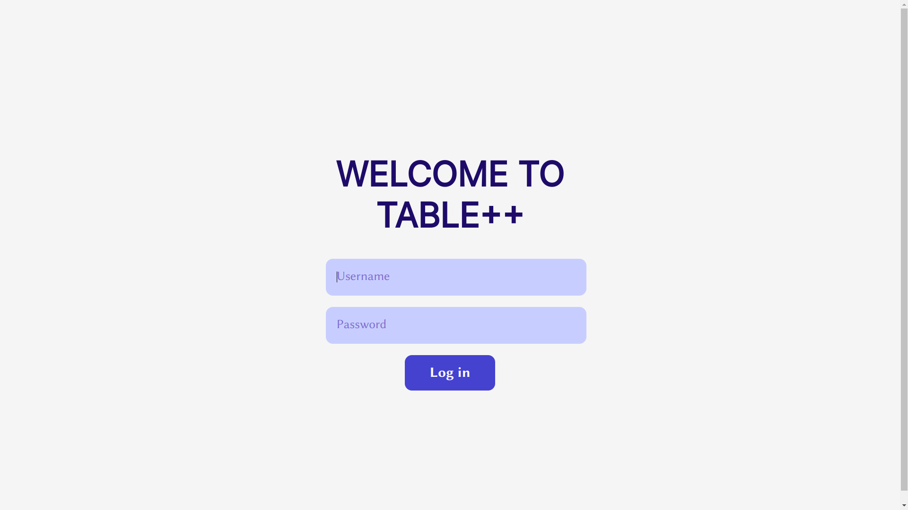

### Update user info page
Далі вас автоматично відправить на сторінку налаштувань свого користувача.
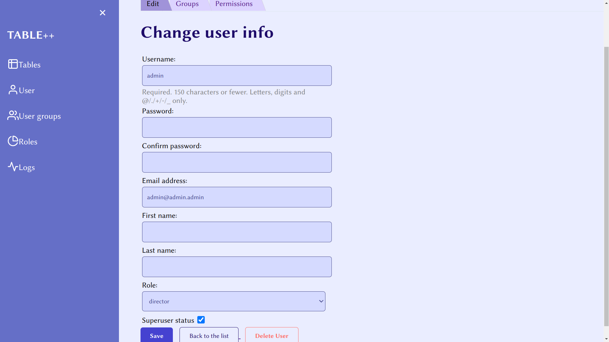
Якщо у вас є права супер адміна, ви зможете змінити будь-який пункт в даних будь-якого користувача, а також видалити будь-якого користувача.
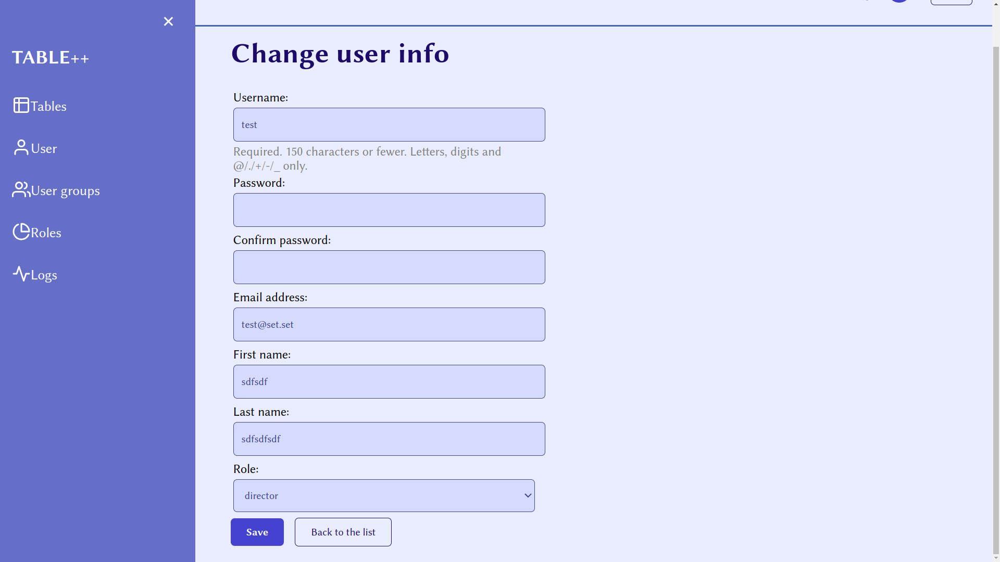
Можна помітити, що якщо залогінитись з акаунту не супер користувача, ми не матимемо можливості змінити нічого окрім паролю, та не зможемо зайти в профіль інших користувачів.
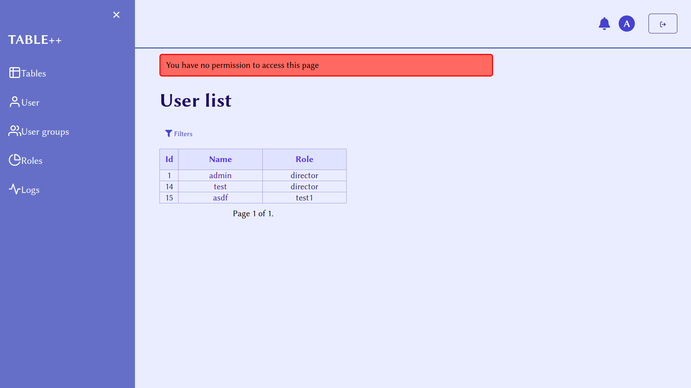

### Update user's groups
На цій сторінці ви зможете додавати користувача до груп, або видаляти звідти.

### Update user's permissions
На цій сторінці ви зможете надавати дозволи кожному користувачу окремо
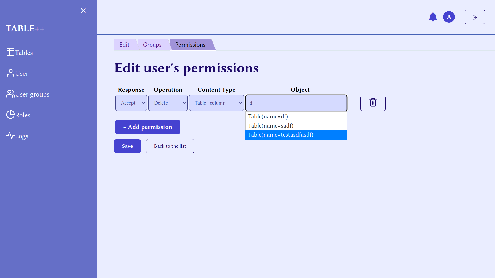

### User groups 
Тут можна переглянути список груп. 

Заходити до налаштувань кожної групи можуть тільки супер користувачі.
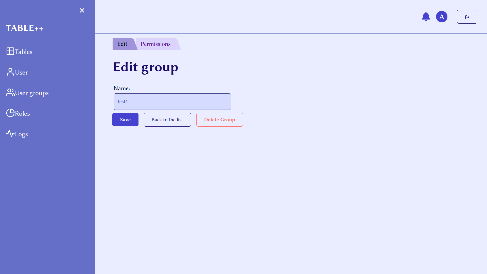
Кожній групі можна надавати дозволи які будуть гарантовані для кожного користувача в цій групі.
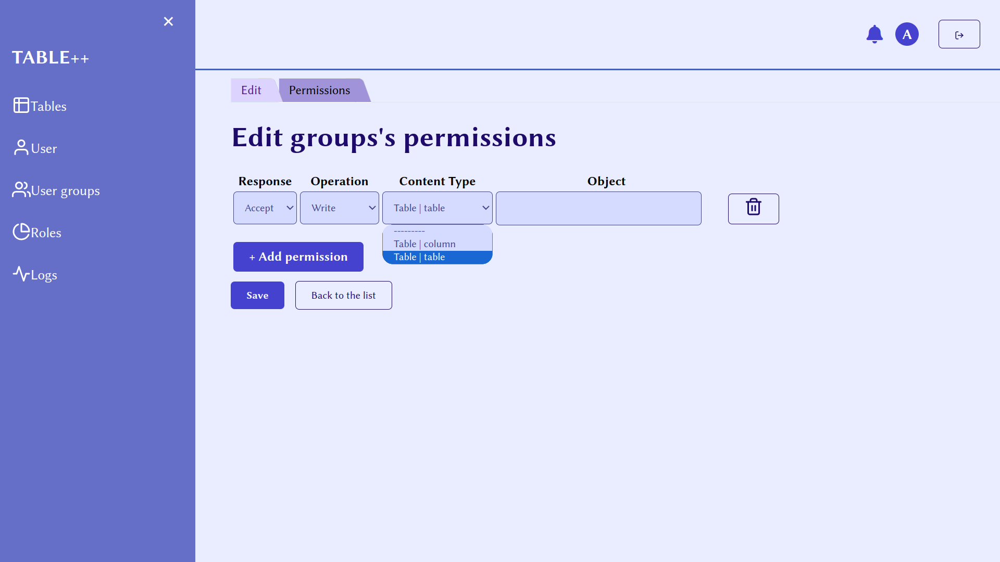

### Roles
Список ролей
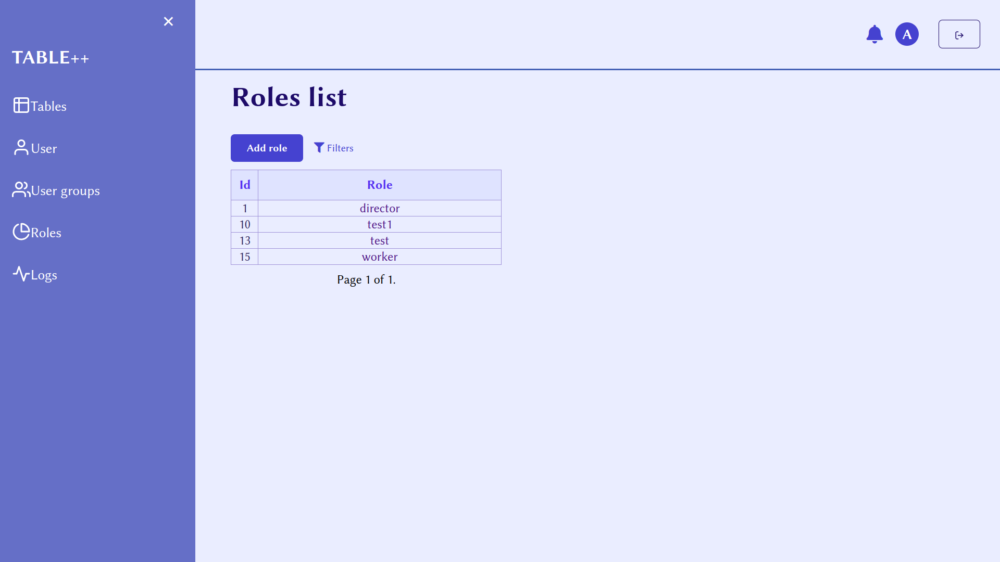
Налаштування ролі
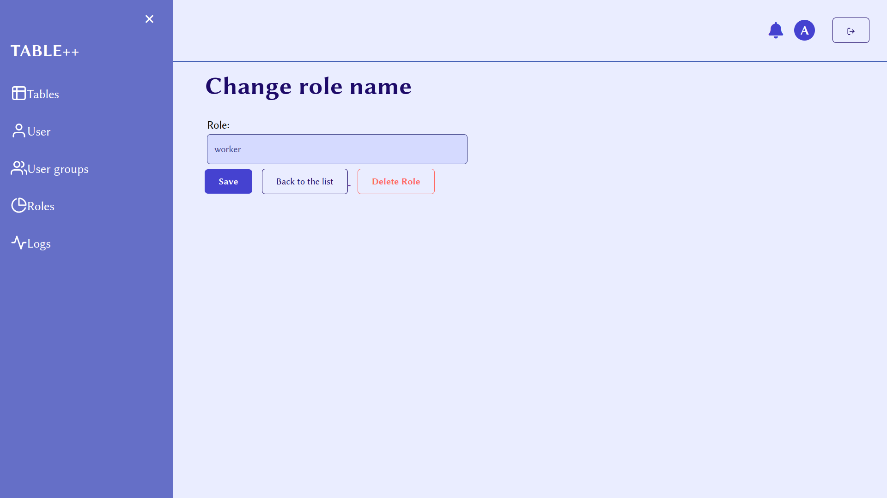

### Tables
Коли ми перейдемо до таблиць, побачимо список вже існуючих таблиц.
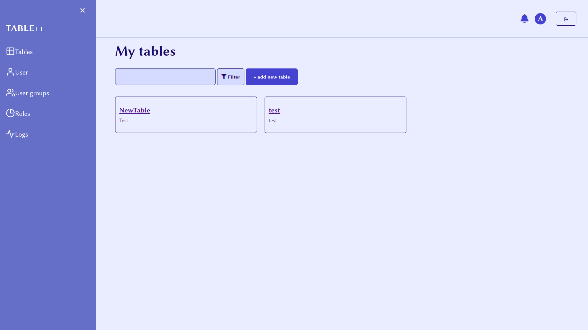
Спробуємо створити нову таблицю, окрім перерахованого вище, ми зможемо також вказати обмеження для кожного поля, та способи фільтрації для пошуку відповідних даних.
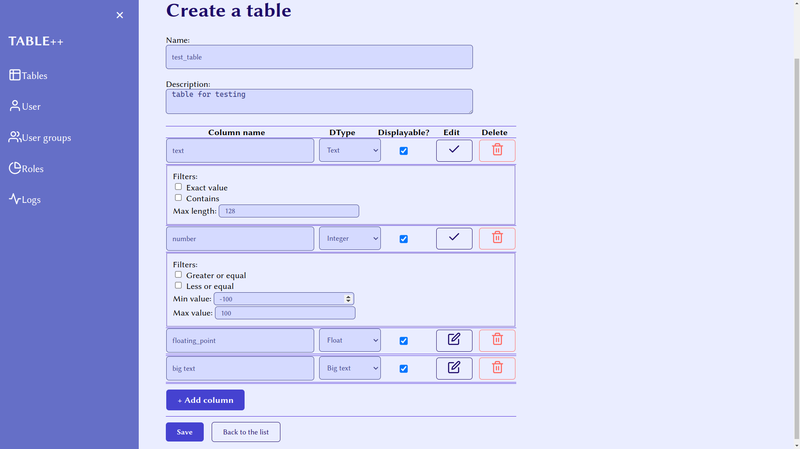
Як ми бачимо, ми не можемо виходити за вказані обмеження.
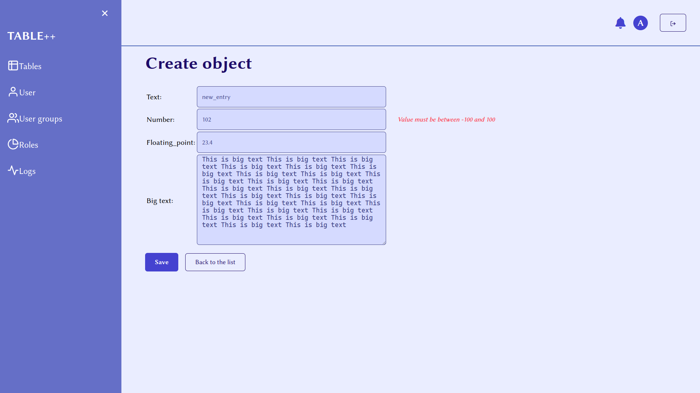
Таким чином відображається список входжень. Також є можливість експортувати дані в excel таблицю
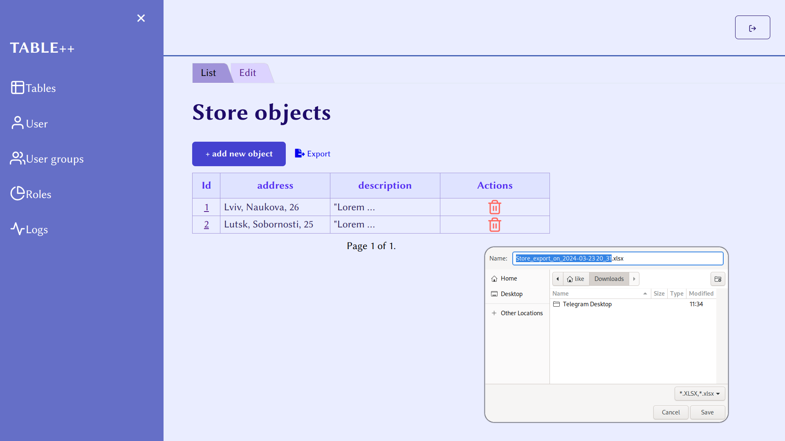

Ми можемо редагувати інформацію про кожну таблицю чи її об'єкти.

### Logs
Реалізовано логування дій, як можемо бачити, створення нашого нового об'єкту було додано в таблицю логів
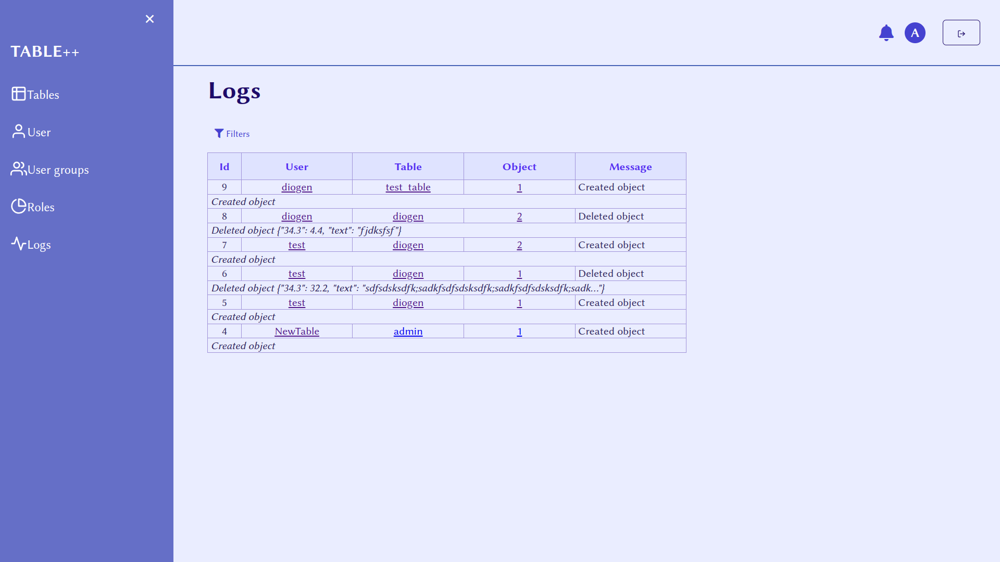

