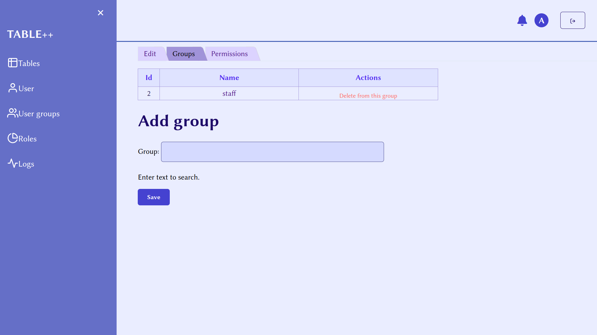
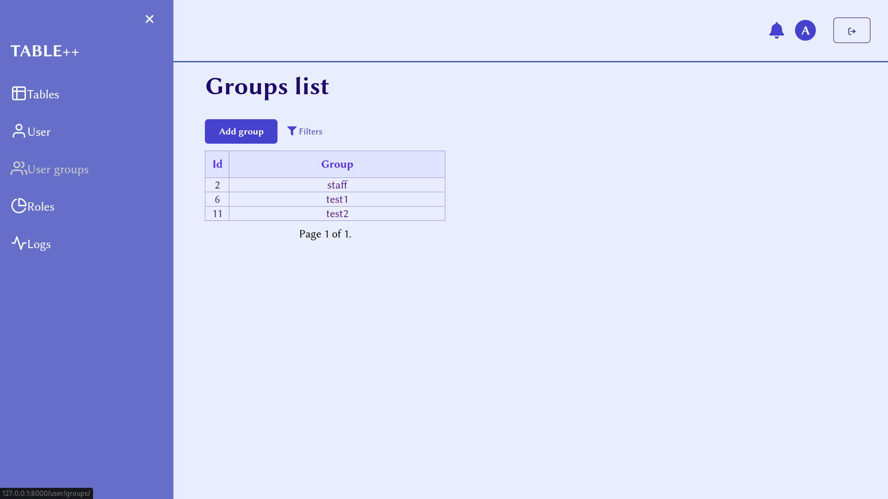

# TABLE++

- [TABLE++](#table)
- [1. Login page](#login-page)
- [2. User model](#user-model)
    - [2.1 User credentials](#update-user-info-page)
        - [2.1.1 Update user info page](#update-user-info-page)
        - [2.1.2 Update user's groups](#update-users-groups)
        - [2.1.3 Update user's permissions](#update-users-permissions)
    - [2.2 User groups](#user-groups)
        - [2.2.1 User group info](#user-groups) 
        - [2.2.2 User group permissions](#user-groups-permissions) 
    - [2.3 Roles](#roles)
        - [2.3.1 Role list](#role-list)
        - [2.3.2 Role settings](#role-settings)
- [3. Tables](#tables)
    - [3.1 Table list](#table-list)
    - [3.2 Table creation](#table-creation)
- [4. Logs](#logs)

This application was created to simplify and speed up accounting in small companies. 

The main models are tables and their columns, users, groups, permissions and roles. Each user contains information about the corresponding employee (their name, role, email, password, whether they are a super user). 

A system of permissions is also implemented, with the help of which the user is given the opportunity or is prohibited from performing certain actions actions.

The main feature of our application is the ease of adding new entries. To do this, we enter the necessary data in a special window, and they are automatically added. 

### Login page
On the login page, you must enter the username and password provided to you by the administrator

### User model
#### Update user info page
After login you will be automatically sent to your user's settings page.

If you have super admin rights, you can change any item in any user's data, as well as delete any user.

You may notice that if you log in from a non-super user account, you won't be able to change anything but your password and won't be able to access other users' profiles.

#### Update user's groups
On this page, you can add users to groups or remove them from them. Only super users have an access to this page.

#### Update user's permissions
On this page, you can grant permissions to each user individually. Such permissions are in higher priority than group permissions. Only super users have an access to this page.

### User groups 
Here you can view the list of groups. 

Only super users can access the settings of each group.

#### User groups permissions
Each group can be granted permissions that will be guaranteed for each user in this group. Only super-users can access this page.

### Roles
#### Role list
Here you can see a list of roles.

#### Role settings
You can change a name of the role. Only super users have an access to this page.

### Tables
#### Table list
When we go to tables, we will see a list of existing tables.

#### Table creation
Let's try creating a new table, in addition to the above, we can also specify the limits for each field, and how to filter to find the relevant data.

As we can see, we cannot go beyond these limits.

#### Object list
This displays a list of entries. It is also possible to export data to an excel spreadsheet

We can edit information about each table or its objects.

### Logs
Implemented logging of actions, as you can see, the creation of our new object has been added to the log table

